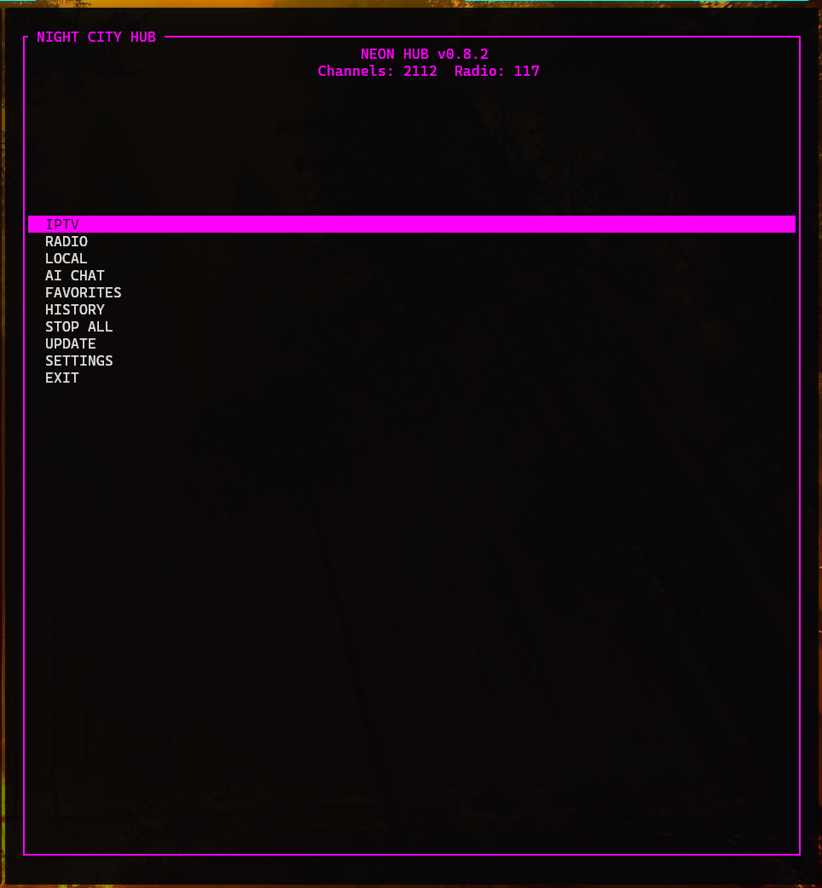
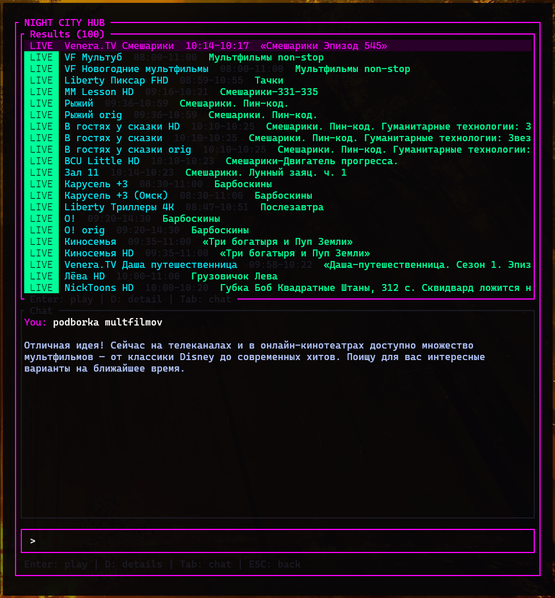
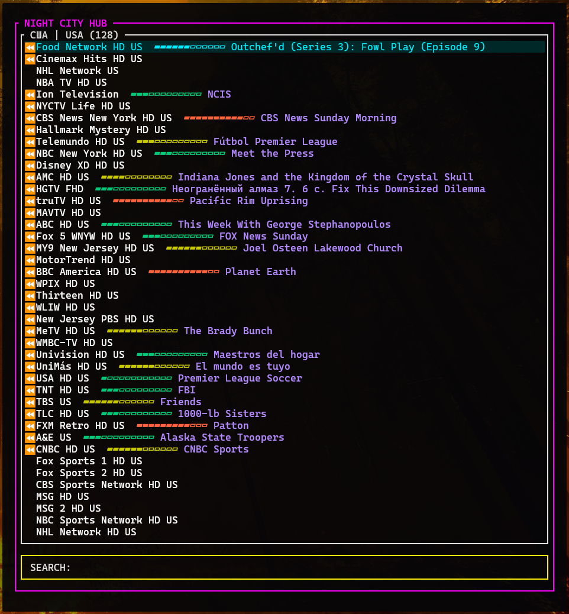
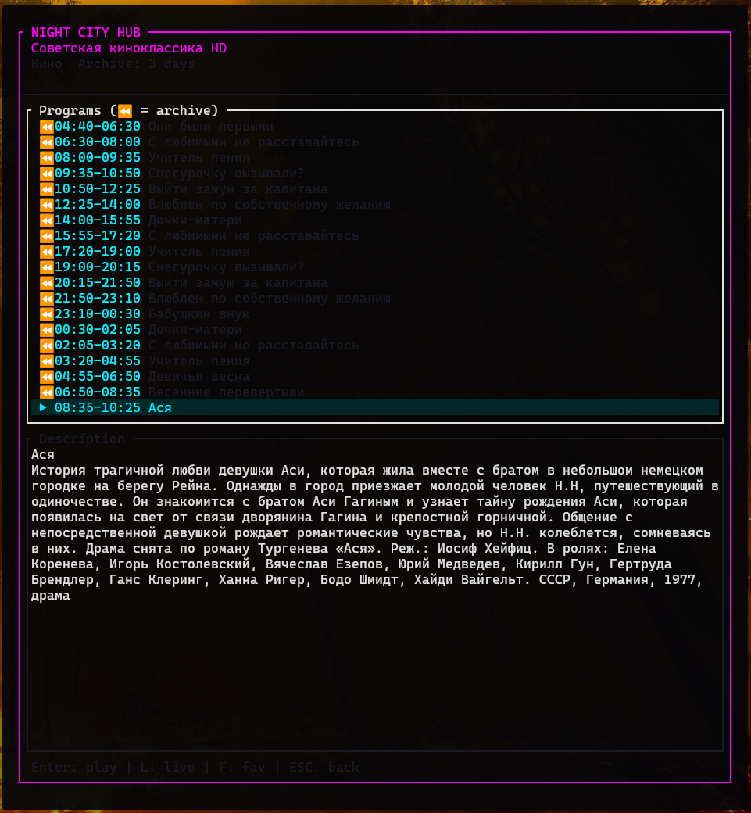
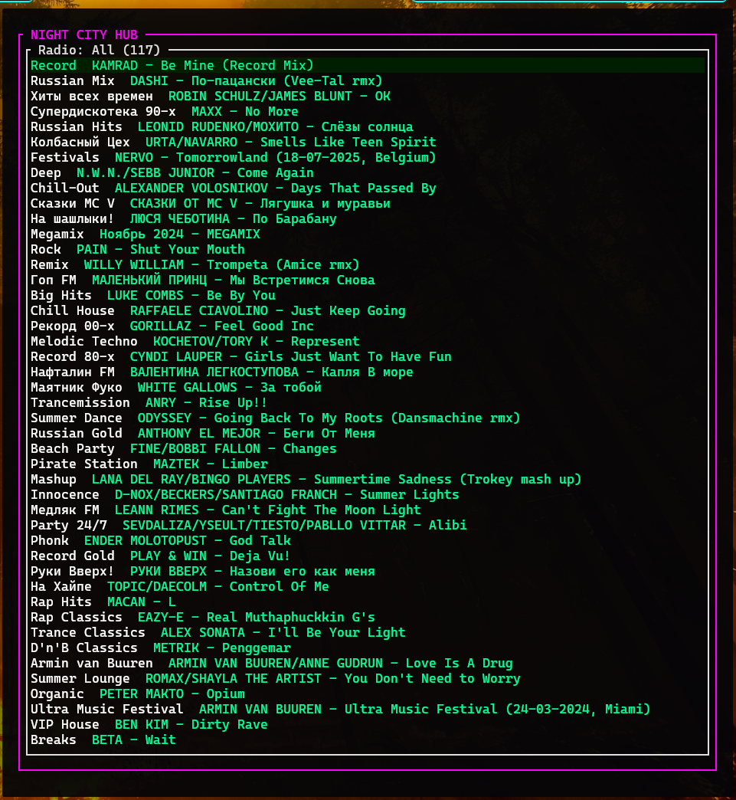

# NEON IPTV — The Only Terminal IPTV Player with a Built-in AI Brain

**Ask your TV "what comedies are on tonight?" and get results you can play with one keypress.**

NEON IPTV is a 2400-line Rust TUI that combines an IPTV/Radio player with a live LLM assistant. The AI sees your full EPG (thousands of programs across hundreds of channels), understands your viewing history, and finds exactly what you want — in natural language, in under 2 seconds.

No Electron. No browser. No 500MB RAM for a channel list. Just a 4.3MB static binary, 15MB RSS, and mpv doing what mpv does best.



## What the AI Actually Does

This isn't a chatbot bolted onto a player. The LLM is wired into the EPG search engine:

1. **You ask** — "horror movies tonight", "что идёт на спортивных каналах", "podborka multfilmov"
2. **AI analyzes** — sees live EPG across all channels + your viewing history, generates targeted search keywords
3. **Search engine fires** — TF-IDF scoring across every program title and description, live results ranked first
4. **You play** — select any result, hit Enter. Live stream, archive, or timeshift — one keypress



The AI costs ~$0.001 per query (DeepSeek V3). Without an API key, everything else works normally.

## Why Rust + mpv

- **4.3MB binary, 15MB RSS** — cold start under 100ms. Binary cache (bincode) means zero re-parsing on launch
- **mpv as the player** — not a built-in video widget. Your system mpv with your configs, your shaders (`CAS`, `FSR`), your `vaapi`/`vulkan` hwdec. The app manages mpv as an async child process and gets out of the way
- **Fully async** — tokio runtime: HTTP fetches, mpv lifecycle, radio track info, AI chat — nothing blocks the UI
- **Terminal-native** — runs over SSH, in tmux, on a headless server driving a TV

## Screenshots

### Channel Browser — live EPG with progress bars


### Detail Screen — full schedule with archive playback


### Radio — 100+ stations with live track info


## Features

### IPTV
- Category browser with channel counts, real-time search filter
- Live EPG progress bars (gradient green → yellow → red)
- TimeShift / Archive — play past programs via catchup URLs (`tvg-rec` auto-detection)
- Channel markers: `★` favorites, `⏪` archive-capable
- Detail screen: full EPG schedule, program descriptions, one-key playback

### Radio
- Radio Record stations with genre categories
- Async now-playing track info (artist — song), non-blocking
- Background playback — TUI stays interactive while radio plays

### AI Assistant
- DeepSeek V3 (or any OpenAI-compatible API)
- Context-aware: live EPG + viewing history fed to LLM on every query
- Auto keyword extraction → real-time EPG search
- Split-screen: results (top) + chat (bottom), Tab to switch focus

### Video
- mpv as external player — your config, your shaders, your hwdec
- Async process management via `tokio::process` (12h timeout)
- Fullscreen or windowed (configurable geometry)
- Suspended mode: TUI hides during video, auto-restores on exit

### Performance
- **4.3MB** fat LTO binary (Clang + LLD, target-cpu optimized)
- **~15MB RSS** — no Electron, no GC
- **Instant startup** — versioned bincode cache
- **Zero-copy XML** — EPG parsed with `quick-xml` SAX state machine

## Requirements

- **Linux** (tested on Arch/CachyOS)
- **mpv** — `pacman -S mpv` / `apt install mpv`
- **Rust toolchain** — for building from source
- **niri** (optional) — Wayland compositor for suspended video mode
- **DeepSeek API key** (optional) — for AI assistant

## Quick Start

```bash
git clone https://github.com/nicorp/ip_tv-neon.git
cd ip_tv-neon
cargo build --release
cp target/release/ip_tv-neon ~/.local/bin/ip_tv
```

```bash
ip_tv              # Launch TUI
ip_tv update        # Update playlist + EPG + radio
ip_tv diag          # Show diagnostics
```

1. Settings → Playlist URL → paste your M3U/M3U8
2. Main Menu → Update
3. IPTV → pick category → pick channel → Enter

### AI Setup (optional)

```bash
export DEEPSEEK_API_KEY="sk-your-key-here"  # add to shell profile
```

## Configuration

| Path | Description |
|------|-------------|
| `~/.config/neon-iptv/config.json` | URLs, theme, favorites, history |
| `~/.cache/neon-iptv/data.bin` | Binary cache (channels, EPG, radio) |

```json
{
  "playlist_url": "https://example.com/playlist.m3u",
  "epg_url": "http://epg.one/epg.xml.gz",
  "theme_color": [0, 255, 255],
  "video_fullscreen": true,
  "video_geometry": "1280x720"
}
```

7 built-in themes: Cyan, Magenta, Neon Green, Orange, Purple, Yellow, Red.

## Keyboard Controls

| Key | Action |
|-----|--------|
| `↑` / `↓` | Navigate |
| `Enter` | Select / Play |
| `Esc` | Back / Stop |
| `Ctrl+C` | Quit |
| `f` | Toggle favorite |
| `d` | Channel detail (EPG) |
| `l` | Play live (in Detail) |
| `Tab` | Switch focus (AI Chat) |
| Type | Search filter / Chat input |

## Architecture

```
src/
├── main.rs     Entry point, async event loop, key dispatch
├── ui.rs       TUI rendering (ratatui)
├── app.rs      State, mpv control, filters
├── ai.rs       LLM chat, keyword extraction, EPG search engine
├── epg.rs      M3U/XMLTV/radio parsing, binary cache
├── models.rs   Data structures, config
├── utils.rs    Helpers
└── consts.rs   Constants, XDG paths
    ─────
    ~2500 lines
```

## Built With

| Component | Stack |
|-----------|-------|
| Language | Rust (async, tokio) |
| TUI | ratatui + crossterm |
| Player | mpv (external process) |
| AI | DeepSeek V3 API |
| Build | Clang + LLD, fat LTO, target-cpu optimized |

## About

Written by [Claude](https://claude.ai) (Anthropic) under the architectural direction of a human SRE. Every design decision, feature scope, and code review — human. Every line of code — AI. This is what human-AI collaboration looks like when the human knows what they want and the AI knows how to build it.

## License

MIT
